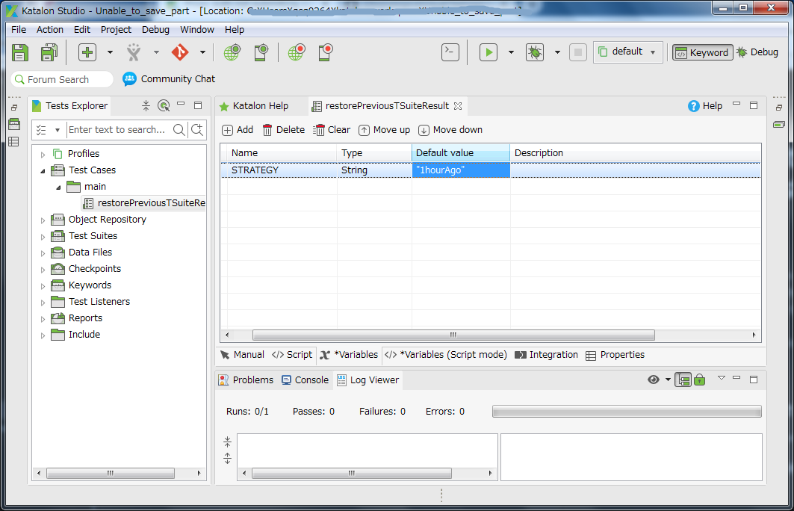
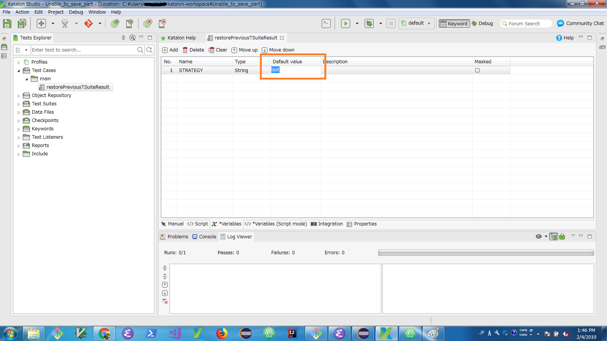
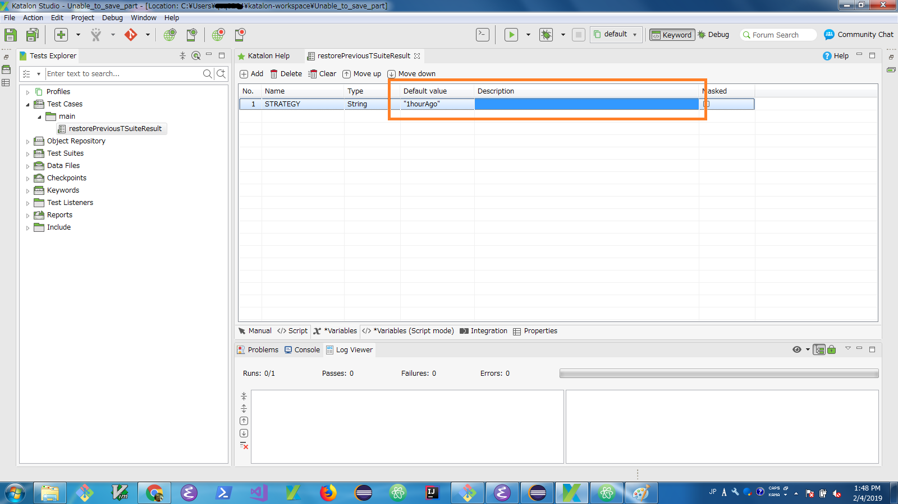
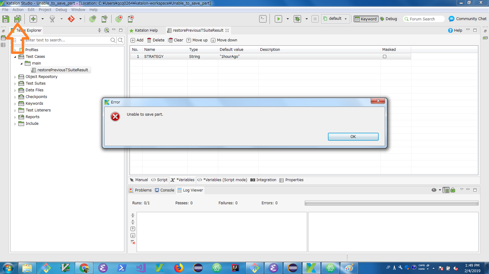
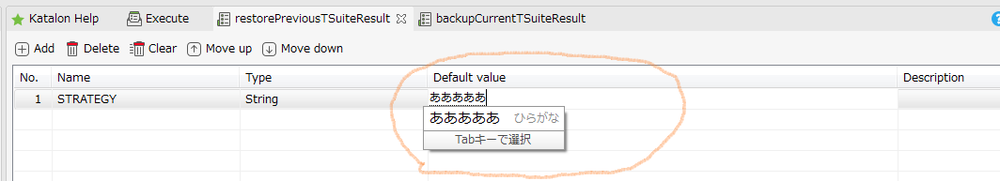

"Unable to save part" error on changing Default value of Variables for Test Case
==================

## What is this?

This is a small Katalon Studio project in order to let you reproduce a problem of Katalon Studio. You can get the zip from [Releases](https://github.com/kazurayam/Unable_to_save_part/releases) page.
 Download the zip, unzip it, open it with your Katalon Studio.

 This project was developed using Katalon Studio version 5.10.1 on Windows 7.

## How to reproduce the problem

1. open the project with your Katalon Studio
2. open the test case named `Test Cases/main/restorePreviousTSuiteResult`
3. click the `Variables` tab.
4. you will find a variable named `STRATEGY` is predefined. It has type of String. It has the default value of `1hourAgo`.



### Problem 1 : changed the default value, but the new value is not displayed

I wanted to change the default value of the `STRATEGY` variable from `1hourAgo` to a new value `last`.

In the Variables tab, at the row of `STRATEGY`, in the input field of Default value , I typed in the new value `last`. See the screenshot:



Then I moved the cursor out of the input field. I expected that the new value `last` to be displayed in the field, of course. Howerver, to my biggest surprise, **the input field displayed the old value `1hourAgo`**.



I thought I need to retype the new value, so I moved the cursor in to the input field of Default value, `last` came up! The input field knew the new value `last` but does not show it up. Why? I do not find any rational explanation for this behavior.

### Problem 2 : `Unable to save part` when tried to save the change

I thought the new value `last` is accepted (though it is not shown up). So I wanted to save the settings into disk. I clicked the Save All button. Then a Error dialog came. **It said "Unable to save part".**



I was unable to save the change at all.

### Problem 3 : you may not reproduce this incident

On 5th Feb, 2019 I encountered this incident. So I reported [this](https://forum.katalon.com/t/unable-to-save-part-can-not-change-the-default-value-of-variable-to-test-case/18800/6) to Katalon Forum.

On 6th Feb, 2019 I tried to reproduce this incident. **But the incident NOT happend**. The value of Default value was happily updated, the change was successfully stored without "Unable to store part" dialog.

Why not? I have no idea.

## My thought

### IME is the clue

I believe that this incident has something to do with IME: Input Method Editor.

But what is IME? The following is quotation from [Wikipedia](https://en.wikipedia.org/wiki/Input_method).

>An input method (or input method editor, commonly abbreviated IME) is an operating system component or program that allows any data, such as keyboard strokes or mouse movements, to be received as input. In this way users can enter characters and symbols not found on their input devices. Using an input method is obligatory for any language that has more graphemes than there are keys on the keyboard.

>For instance, on the computer, this allows the user of Latin keyboards to input Chinese, Japanese, Korean and Indic characters; on many hand-held devices, such as mobile phones, it enables using the numeric keypad to enter Latin alphabet characters (or any other alphabet characters) or a screen display to be touched to do so. On some operating systems, an input method is also used to define the behaviour of the dead keys.

See the following picture where you can see IME in action.


I work on a PC with Languate=ja_JP, so IME is fully operational on my PC. But other people who live in English domain are not likely to be familiar with IME because they would never use it. IME is not enabled on their devices.


### What is involved for Java application to work with IME

I am not very much familiar with GUI programing in Java. I wanted to learn how to write a Java program which displays Window using Eclipse SWT API, accept input/output in a IME-enabled text field.

By a quick search I found the following page provides a handy sample code:
[Java2s.com : Add focus in/out event to Text : Text Event « SWT « Java Tutorial](http://www.java2s.com/Tutorial/Java/0280__SWT/AddfocusinouteventtoText.htm)


### What is happening on the Variales tab for Test Case in Katalon Studio?

The [above sample code](http://www.java2s.com/Tutorial/Java/0280__SWT/AddfocusinouteventtoText.htm) has the following fragment.

```
t2.addListener(SWT.FocusOut, new Listener() {
  public void handleEvent(Event e) {
   System.out.println("focus out");
  }
});
```

SWT Text object needs a Listner object registered for the SWT.FocusOut event. The SWT.FocusOut event is fired when I move the cursor out of the IME-enabled input field to somewhere outside of it.

I guess, Katalon Studio has a small shartage. **It does not implement the Listener for the SWT.Forcus out for the Variable input fieds. Or the implemented Listener is imcomplete somehow.**.

Just I guessed so.
